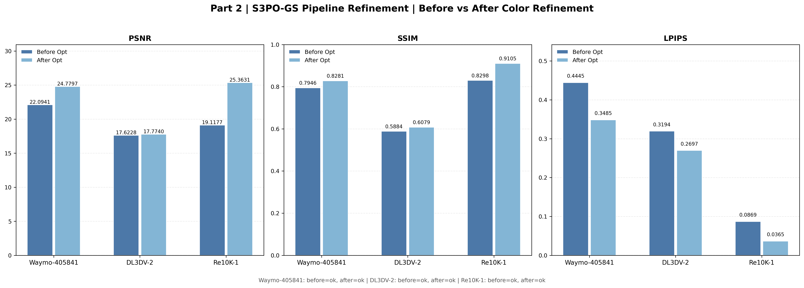

## Part 2

### Environment Configuration

Part 2 is based on S3PO-GS for sparse-keyframe monocular 3DGS-SLAM.

Clone the official S3PO-GS repository under the `CV-Project4` directory:

```bash
cd CV-Project4
git clone https://github.com/3DAgentWorld/S3PO-GS.git
```

The detailed environment configuration should follow the instructions in the official S3PO-GS repository:

* [S3PO-GS](https://github.com/3DAgentWorld/S3PO-GS.git)

### Code Usage

Part 2 evaluates sparse-keyframe monocular SLAM on three datasets:

* Waymo-405841
* DL3DV-2
* Re10k-1

To reproduce the sparsity settings used in Part 2, replace the original S3PO-GS frontend file with the modified version provided in this project:

```bash
cp CV-Project4/Part2/slam_frontend.py CV-Project4/S3PO-GS/utils/slam_frontend.py
```

The modified frontend controls sparse mapping through keyframe interval settings, while keeping the full sequence for tracking.

When running S3PO-GS, specify the configuration files provided in:

```bash
CV-Project4/Part2/configs/
```

For example:

```bash
cd CV-Project4/S3PO-GS

python slam.py --config ../Part2/configs/[config_file].yaml
```

Replace `[config_file].yaml` with the corresponding configuration file for the dataset and setting you want to run.

The Part 2 experiments use the following sparse mapping settings:

* Waymo-405841: 1/10 sparsity
* DL3DV-2: 1/30 sparsity
* Re10k-1: 1/30 sparsity

### Color Refinement Visualization

After running the Part 2 experiments, you can visualize the metric differences before and after color refinement.

Enter the Part 2 folder:

```bash
cd CV-Project4/Part2
```

Then run:

```bash
python part2_pipeline_refinement_visualization.py \
  --waymo405841 [actual_path_dir] \
  --dl3dv2 [actual_path_dir] \
  --re10k1 [actual_path_dir]
```

Replace `[actual_path_dir]` with the actual output directory of each dataset experiment.

The visualization result will be saved by default to:

```bash
CV-Project4/Part2/results/fig/part2_pipeline_refinement_comparison.png
```

Example visualization:


