<h1 align="center">Project4: Generative Sparse-View 3D Reconstruction</h1>

<p align="center">
  <b>Enji Xiong</b> &nbsp;·&nbsp; <b>Yuk Yeung Wong</b> <br/>
  AIAA 3201—Introduction to Computer Vision &nbsp;|&nbsp; Final Project, Spring 2026
</p>

This repository contains the implementation and experiments for **Project 4: Generative Sparse-View 3D Reconstruction**. The project studies sparse-view 3D reconstruction through three stages:

1. Dense-view initialization and Gaussian optimization.
2. Sparse-keyframe monocular 3DGS-SLAM.
3. Generative pseudo-view enhancement with confidence-guided optimization.

---

## Abstract

> This project investigates sparse-view 3D reconstruction under increasingly challenging settings. First, COLMAP and VGGT are compared as initialization methods under 3DGS and Wavelet-GS optimization. Second, S3PO-GS is used for sparse-keyframe monocular 3DGS-SLAM, where full-frame tracking is preserved but mapping uses sparse keyframes. Third, a BRPO-inspired pseudo-view pipeline is introduced, using bidirectional Difix3D+ refinement, reprojection-based fusion, confidence masking, and masked RGB-D optimization.

> The experiments show that COLMAP provides stronger initialization when reliable correspondences are available, while Wavelet-GS improves performance under stable COLMAP initialization. In sparse-keyframe SLAM, color refinement improves rendering quality but outdoor scenes still suffer from scale drift and map collapse. Pseudo-view optimization improves DL3DV-2 rendering and pose estimation, but its benefit is limited when pseudo-view reliability is affected by scale drift or when the sparse-only baseline is already strong.

---

## Introduction

Sparse-view 3D reconstruction aims to recover accurate geometry and photorealistic novel views from limited observations. Although 3D Gaussian Splatting enables efficient scene optimization and real-time rendering, it remains sensitive to:

- camera pose accuracy,
- initialization quality,
- multi-view overlap,
- sparse-view supervision.

This project follows a progressive pipeline:

- **Part 1:** evaluates initialization and optimization under dense-view reconstruction.
- **Part 2:** studies sparse-keyframe monocular 3DGS-SLAM without given camera poses.
- **Part 3:** adds generative pseudo-view supervision to improve sparse-view reconstruction.

The main goal is to analyze how initialization, online pose estimation, and generative pseudo-view enhancement affect rendering quality, pose stability, and reconstruction robustness.

---

## Related Work

This project is built on four groups of related methods:

- **3D Gaussian Splatting:** 3DGS represents scenes with explicit anisotropic Gaussian primitives for efficient differentiable rendering. Wavelet-GS further improves reconstruction by decomposing scene information into low- and high-frequency components.

- **Sparse-view Reconstruction and Initialization:** COLMAP provides SfM-based camera poses and sparse points, while VGGT predicts camera geometry and dense point maps in a feed-forward manner. Other foundation models such as DUSt3R, Pi3, and MapAnything also motivate learning-based geometry initialization.

- **Monocular 3DGS-SLAM:** S3PO-GS addresses outdoor RGB-only SLAM by using 3DGS-rendered pointmaps for scale-consistent pose estimation and dynamic mapping. This motivates the sparse-keyframe monocular SLAM setting in Part 2.

- **Pseudo-view Generation and Diffusion Enhancement:** BRPO introduces bidirectional pseudo-frame restoration and confidence fusion for sparse-view reconstruction. Difix3D+ shows that diffusion-based refinement can improve degraded rendered views. These ideas motivate the confidence-guided pseudo-view optimization in Part 3.

---

## Method

### Part 1: Initialization and Gaussian Optimization

Part 1 compares two initialization methods and two Gaussian optimization backends.

**Initialization methods:**

- COLMAP-based SfM initialization.
- VGGT-based feed-forward foundation model initialization.

**Optimization backends:**

- Standard 3DGS.
- Wavelet-GS.

Due to VGGT memory constraints, the main Part 1 experiments use uniformly sampled 96-frame subsets. A supplementary comparison shows that uniform frame sampling performs better than reducing input resolution.

### Part 2: Sparse-keyframe Monocular 3DGS-SLAM

Part 2 uses S3PO-GS for sparse-keyframe monocular SLAM. The full sequence is used for tracking, but only sparse keyframes are used for mapping.

The sparsity settings are:

- Waymo-405841: 1/10 mapping sparsity.
- DL3DV-2: 1/30 mapping sparsity.
- Re10k-1: 1/30 mapping sparsity.

This setting preserves online tracking while enforcing sparse mapping, making it suitable for evaluating scale drift, map collapse, and rendering degradation under sparse supervision.

### Part 3: Confidence-guided Pseudo-view Optimization

Part 3 introduces pseudo-view supervision between sparse keyframes.

The pseudo-view pipeline includes:

1. **Pseudo pose selection and coarse rendering**
   - Intermediate pseudo poses are selected from tracked non-keyframes when available.
   - The current Gaussian map is rendered at the pseudo pose.

2. **Bidirectional Difix3D+ refinement**
   - The coarse pseudo-view is refined twice using the previous and current keyframes as references.

3. **Reprojection-based fusion**
   - The two refined candidates are fused using reprojection overlap scores.

4. **Confidence mask construction**
   - Feature consistency, reprojection consistency, and opacity validity are used to select reliable regions.

5. **Masked RGB-D optimization**
   - Pseudo-views are used only as auxiliary supervision.
   - They are not inserted into the tracking stream, mapping window, densification, or pruning.

---

## Experiments

### Experimental Setup

All experiments are conducted on:

- 2 × NVIDIA RTX A6000 GPUs.
- 24-core AMD EPYC 7763 64-Core Processor.

Datasets:

- **Waymo-405841:** outdoor autonomous-driving sequence with large camera motion and depth variation.
- **DL3DV-2:** outdoor scene with richer texture and relatively stable multi-view overlap.
- **Re10k-1:** indoor scene with smoother camera motion but repeated textures and limited baseline.

Metrics:

- Rendering quality: PSNR, SSIM, LPIPS.
- Pose estimation: ATE RMSE.

---

### Part 1 Results

Part 1 evaluates initialization and optimization under a fixed optimization budget.

Main observations:

- COLMAP initialization generally performs better than VGGT on DL3DV-2 and Re10k-1 when sufficient correspondences are available.
- Wavelet-GS improves over 3DGS under stable COLMAP initialization.
- With VGGT initialization, the advantage of Wavelet-GS is less consistent.
- Full-frame COLMAP+3DGS performs better than 96-frame COLMAP+3DGS, showing that sparse frame sampling weakens SfM initialization.
- On Waymo-405841 with 96 frames, COLMAP+3DGS fails due to abnormally sparse or nearly invisible initialized Gaussians.

Representative trends:

| Comparison | Observation |
|---|---|
| COLMAP vs. VGGT | COLMAP is stronger on DL3DV-2 and Re10k-1 when SfM succeeds. |
| 3DGS vs. Wavelet-GS | Wavelet-GS benefits more from stable COLMAP initialization. |
| Full frames vs. 96 frames | Full-frame training gives better 3DGS results. |
| Waymo-405841 96-frame COLMAP+3DGS | Training fails due to weak initialization and sparse visible Gaussians. |

#### Part 1 Visualization

<p align="center">
  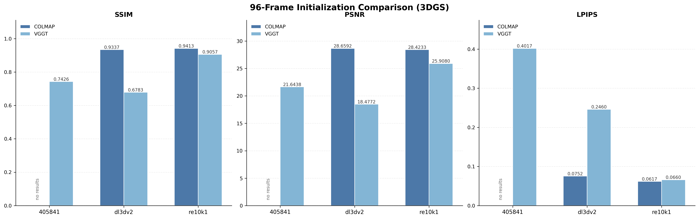
  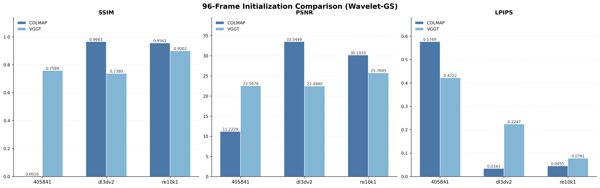
</p>

<p align="center">
  <b>Initialization comparison.</b> COLMAP and VGGT are compared under 3DGS and Wavelet-GS optimization.
</p>

<p align="center">
  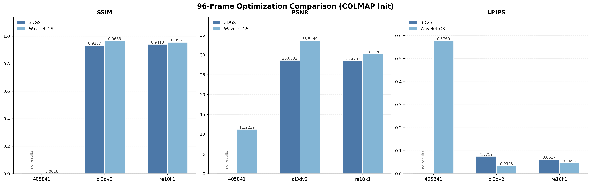
  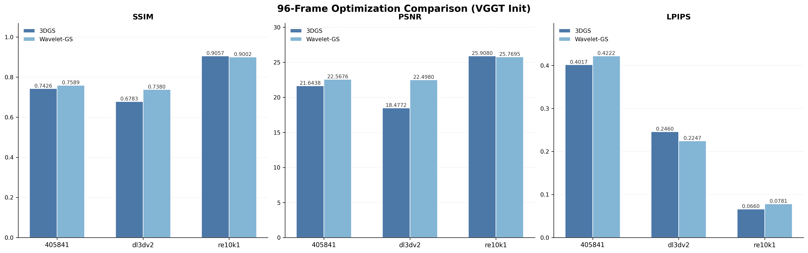
</p>

<p align="center">
  <b>Optimization comparison.</b> 3DGS and Wavelet-GS are compared under fixed COLMAP and VGGT initialization.
</p>

---

### Part 2 Results

Part 2 evaluates sparse-keyframe monocular 3DGS-SLAM with and without color refinement.

Color refinement improves rendering quality on all datasets, with stronger gains on Waymo-405841 and Re10k-1. The improvement on DL3DV-2 is more limited, suggesting that its main errors are not purely photometric but also related to local geometric instability.

| Dataset | Setting | PSNR | SSIM | LPIPS |
|---|---|---:|---:|---:|
| Waymo-405841 | before color refinement | 22.09 | 0.795 | 0.444 |
| Waymo-405841 | after color refinement | 24.78 | 0.828 | 0.349 |
| DL3DV-2 | before color refinement | 17.62 | 0.588 | 0.319 |
| DL3DV-2 | after color refinement | 17.77 | 0.608 | 0.270 |
| Re10k-1 | before color refinement | 19.12 | 0.830 | 0.087 |
| Re10k-1 | after color refinement | 25.36 | 0.910 | 0.037 |

Additional observations:

- Waymo-405841 shows clear scale drift in ATE evaluation.
- DL3DV-2 shows local map collapse in rendered RGB, depth, and residual maps.
- These failures motivate the pseudo-view constraints introduced in Part 3.

#### Part 2 Visualization

<p align="center">
  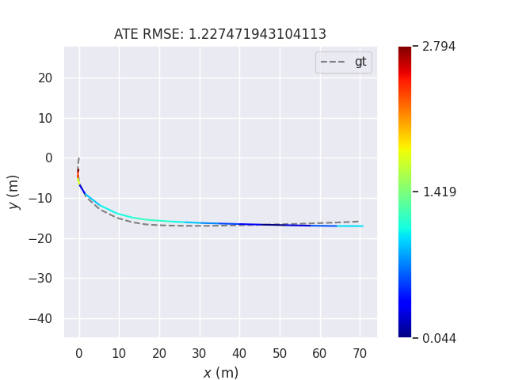
  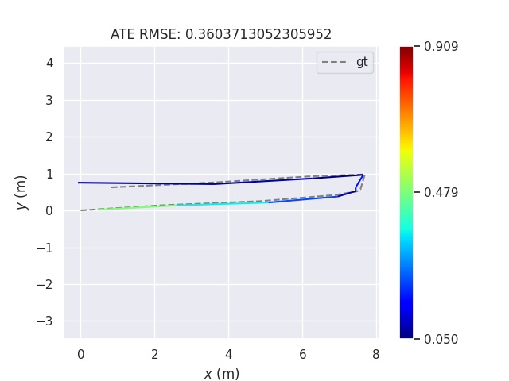
  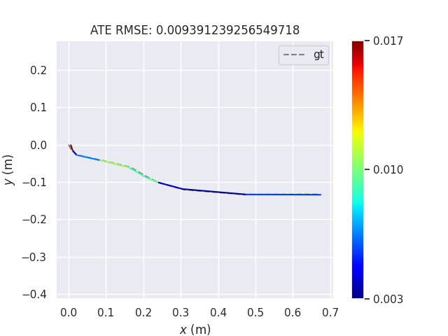
</p>

<p align="center">
  <b>Final ATE trajectory visualization.</b> The three figures correspond to Waymo-405841, DL3DV-2, and Re10k-1.
</p>

---

### Part 3 Results

Part 3 compares the sparse-only SLAM baseline with pseudo-view enhanced optimization.

| Dataset | Setting | PSNR | SSIM | LPIPS |
|---|---|---:|---:|---:|
| Waymo-405841 | Sparse only | 24.78 | 0.828 | 0.349 |
| Waymo-405841 | Sparse + pseudo-views | 21.41 | 0.783 | 0.459 |
| DL3DV-2 | Sparse only | 17.77 | 0.608 | 0.270 |
| DL3DV-2 | Sparse + pseudo-views | 18.45 | 0.629 | 0.241 |
| Re10k-1 | Sparse only | 25.36 | 0.910 | 0.037 |
| Re10k-1 | Sparse + pseudo-views | 25.63 | 0.913 | 0.036 |

Main observations:

- DL3DV-2 benefits from pseudo-view optimization in PSNR, SSIM, LPIPS, and ATE.
- Waymo-405841 does not improve because scale drift makes pseudo-view supervision unreliable.
- Re10k-1 shows only marginal improvement because the sparse-only baseline is already stable.

DL3DV-2 pose estimation improves substantially after pseudo-view optimization:

| Method | RMSE | Mean | Median | Std. | Max |
|---|---:|---:|---:|---:|---:|
| Part 2 | 0.360 | 0.251 | 0.131 | 0.258 | 0.909 |
| Part 3 | 0.082 | 0.074 | 0.066 | 0.035 | 0.135 |

Ablation on DL3DV-2 shows that all pseudo-view components contribute to the final performance:

| Method | PSNR | SSIM | LPIPS |
|---|---:|---:|---:|
| w/o Pseudo Exposure Opt. | 17.82 | 0.590 | 0.267 |
| w/o Pseudo Pose Opt. | 18.04 | 0.607 | 0.262 |
| w/o Low-frequency Color Align. | 17.96 | 0.613 | 0.260 |
| w/o Reprojection Overlap | 16.90 | 0.554 | 0.295 |
| Ours | 18.45 | 0.629 | 0.241 |

The reprojection overlap score is the most critical component. Without it, confidence masks become overly permissive and allow unreliable pseudo-view regions to affect Gaussian optimization.

#### Part 3 Visualization

<p align="center">
  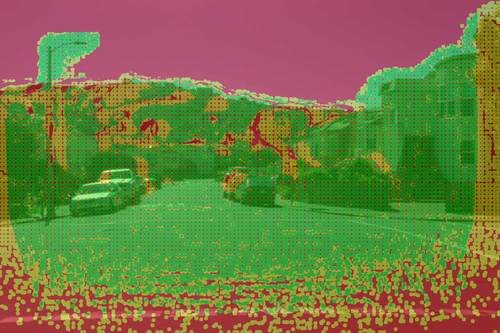
  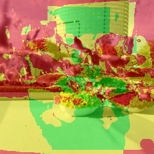
  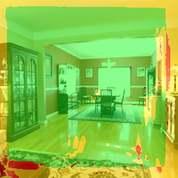
</p>

<p align="center">
  <b>Confidence mask overlay examples.</b> Green regions indicate pseudo-view areas considered reliable for confidence-guided optimization.
</p>

<p align="center">
  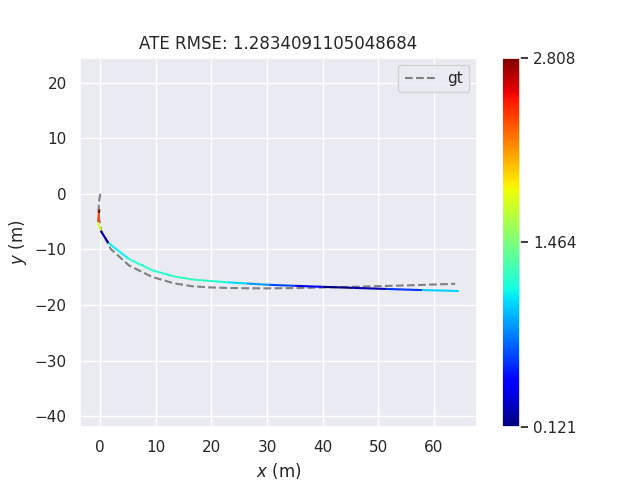
  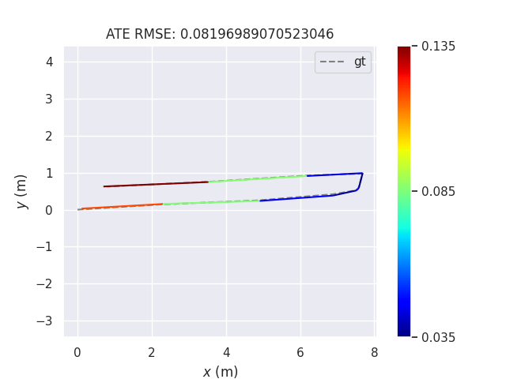
  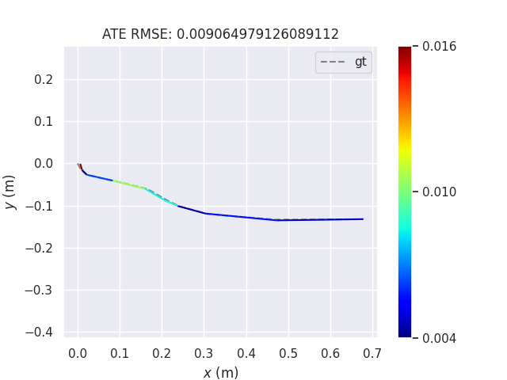
</p>

<p align="center">
  <b>Representative rendering visualizations.</b> These examples summarize pose estimation after pseudo-view refinement.
</p>
---

## Conclusion

This project shows that generative pseudo-views can improve sparse-view 3D reconstruction only when constrained by reliable geometry and pose estimates.

Key conclusions:

- COLMAP is a strong initialization method when sufficient image correspondences are available.
- Wavelet-GS improves reconstruction quality under stable COLMAP initialization.
- Sparse-keyframe monocular SLAM remains vulnerable to scale drift and map collapse.
- Color refinement improves rendering quality but cannot fully solve geometric instability.
- Confidence-guided pseudo-views improve DL3DV-2 rendering and pose estimation.
- Pseudo-view optimization can be harmful when pose drift makes generated supervision unreliable.

Overall, pseudo-views should be treated as confidence-weighted auxiliary supervision rather than direct replacements for real observations.

---

## Reproduction

### Data Preparation

Create a `datasets` folder under the project directory:

```bash
mkdir datasets
```

The required datasets can be downloaded from the following links:

- [Google Drive](https://drive.google.com/drive/folders/1euG7pnbFowljVWoNLcbCmil81IVsIEfM)
- [Baidu Netdisk](https://pan.baidu.com/s/1Sa18zCeYiYA2gWAllo11dg?pwd=p3bm#list/path=%2F)

After downloading the datasets, place them into the `datasets` folder.

For more specific reproduction instructions, please refer to the `README.md` file inside each part folder.

---

## Acknowledgements

Our work is built upon the following projects:

- [S3PO-GS](https://github.com/3DAgentWorld/S3PO-GS)
- [3D Gaussian Splatting](https://github.com/graphdeco-inria/gaussian-splatting)
- [VGGT](https://github.com/facebookresearch/vggt)
- [Wavelet-GS](https://github.com/ALEX5874/Wavelet-GS)
- [Difix3D+](https://github.com/nv-tlabs/Difix3D)
- [gsplat](https://github.com/nerfstudio-project/gsplat)

This project was completed for the AIAA 3201 Introduction to Computer Vision Final Project 4, Spring 2026.

---

## References

- **COLMAP / SfM**
  - Agarwal et al. *Building Rome in a Day*. Communications of the ACM, 2011.

- **3D Gaussian Splatting**
  - Kerbl et al. *3D Gaussian Splatting for Real-Time Radiance Field Rendering*. SIGGRAPH, 2023.
  - Lu et al. *Scaffold-GS: Structured 3D Gaussians for View-Adaptive Rendering*. CVPR, 2024.
  - Zhang et al. *Wavelet-GS: Wavelet Gaussian Splatting for Efficient and High-Fidelity Novel View Synthesis*. 2024.

- **3D Foundation Models and Sparse-view Reconstruction**
  - Wang et al. *DUSt3R: Geometric 3D Vision Made Easy*. CVPR, 2024.
  - Wang et al. *VGGT: Visual Geometry Grounded Transformer*. 2025.
  - Yang et al. *Pi3: Scalable Permutation-Equivariant Visual Geometry Learning*. 2025.
  - Liu et al. *MapAnything: Universal Feed-Forward Metric 3D Reconstruction*. 2025.
  - Fan et al. *InstantSplat: Unbounded Sparse-view Pose-free Gaussian Splatting in 40 Seconds*. 2024.
  - Chen et al. *RegGS: Unposed Sparse Views 3D Gaussian Splatting via 3DGS Registration*. 2024.

- **Monocular 3DGS-SLAM**
  - Xiong et al. *S3PO-GS: Scale-Consistent 3D Gaussian Splatting for RGB-only SLAM in Unbounded Outdoor Scenes*. 2025.
  - Mao et al. *Artdeco: Efficient 3D Scene Representation via 2D Image Features*. 2025.

- **Pseudo-view Generation and Diffusion Enhancement**
  - Zhang et al. *BRPO: Bringing Realistic Pseudo-Observations to Unposed Sparse-View 3D Gaussian Splatting*. 2025.
  - Ma et al. *ReconX: Reconstruct Any Scene from Sparse Views with Video Diffusion Model*. 2025.
  - Wu et al. *Difix3D+: Improving 3D Reconstructions with Single-Step Diffusion Models*. CVPR, 2025.

- **Datasets**
  - Sun et al. *Scalability in Perception for Autonomous Driving: Waymo Open Dataset*. CVPR, 2020.
  - Ling et al. *DL3DV-10K: A Large-Scale Scene Dataset for Deep Learning-Based 3D Vision*. CVPR, 2024.
  - Zhou et al. *Stereo Magnification: Learning View Synthesis using Multiplane Images*. 2018.

- **Additional Related References**
  - Barron et al. *Mip-NeRF 360: Unbounded Anti-Aliased Neural Radiance Fields*. CVPR, 2022.
  - Knapitsch et al. *Tanks and Temples: Benchmarking Large-Scale Scene Reconstruction*. TOG, 2017.
  - Ye et al. *NoPoSplat: Feed-forward 3D Gaussian Splatting from Unposed Images*. 2024.
  - Xu et al. *AnySplat: Feed-forward 3D Gaussian Splatting from Unconstrained Views*. 2025.
  - Xing et al. *DynamiCrafter: Animating Open-domain Images with Video Diffusion Priors*. ECCV, 2024.
